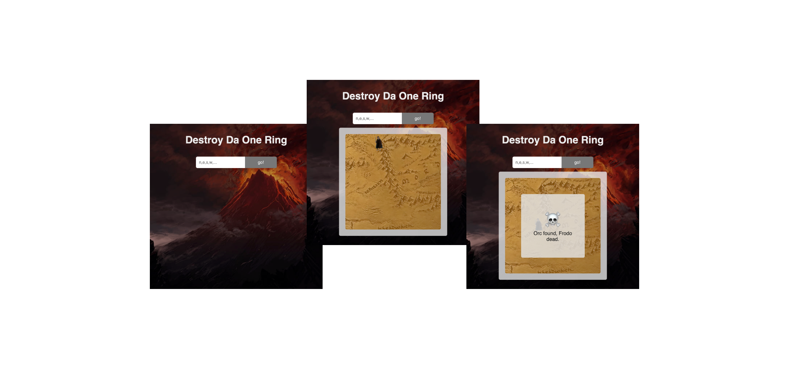

# Destroy Da One Ring

One player battleship style game to guide Frodo to the One Ring.

Input a comma separated list of directions ('n', 'e', 's', 'w') to guide Frodo to the ring. If Frodo encounters an Orc on his way, he expires. Likewise if he wanders off into uncharted lands.

## Screen Shots

## Getting started

- unzip the archive or <code>git clone https://github.com/atsteinberg/destroy-da-one-ring.git</code>

* run <code>npm i</code>in both server and client subfolder, i.e. assuming you are in the main repo folder, run <code>cd client && npm i && cd ../server && npm i && cd ..</code>

* run server and client: (from the main folder:) <code>npm run start:all</code>

- enjoy

## Built with

- [react](https://reactjs.org)

- vanilla ES6 JS for the game-logic

- [Koa](https://koajs.com/)
